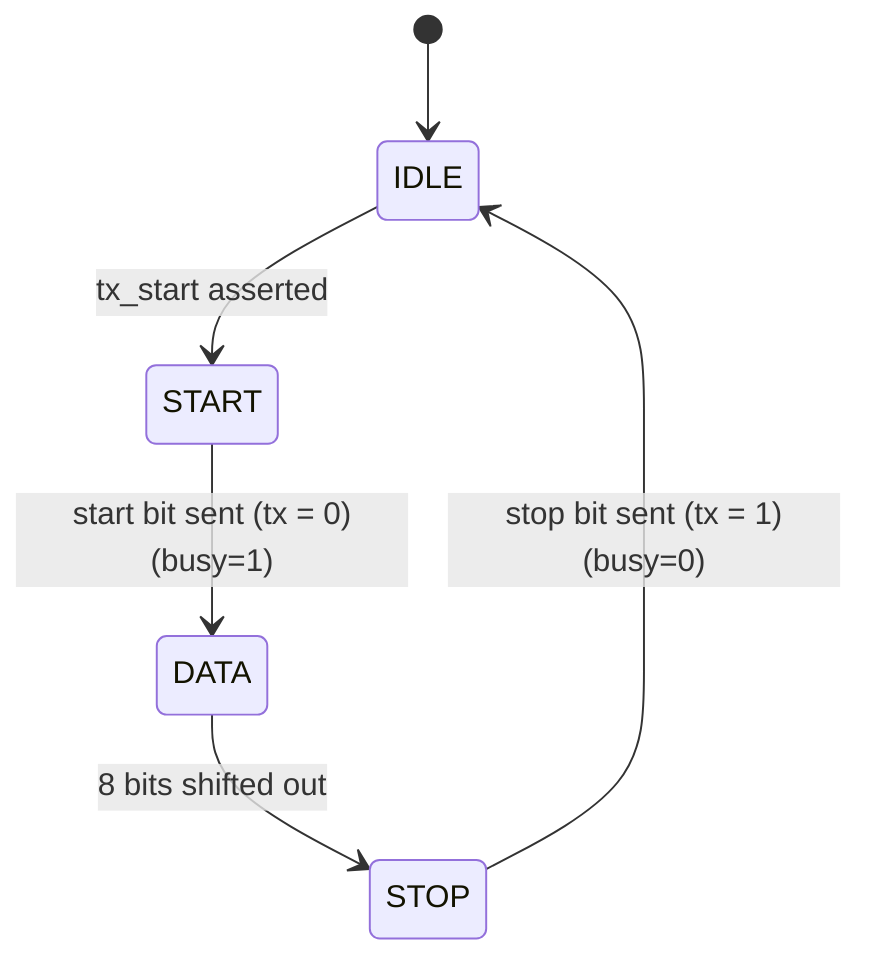
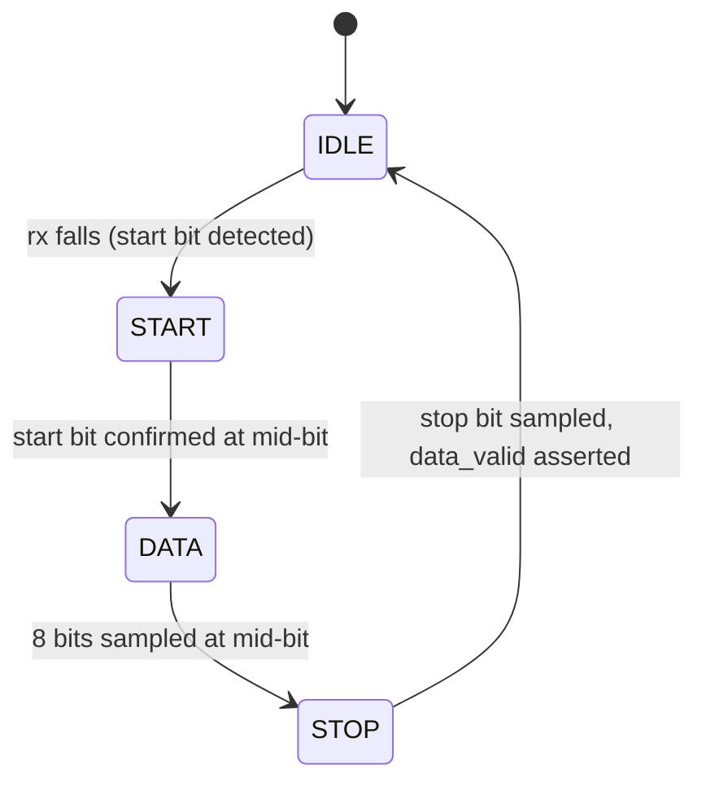
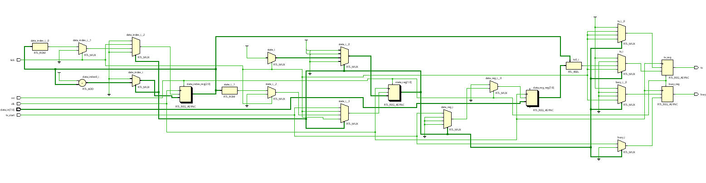
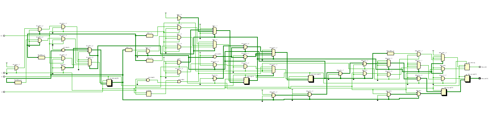
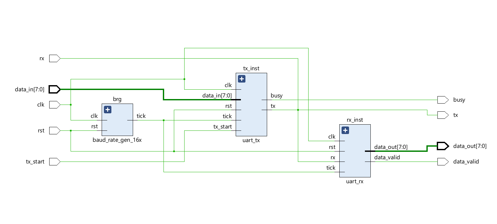

# 🔌 UART Transmitter/Receiver (Verilog)

A fully synthesizable **UART (Universal Asynchronous Receiver/Transmitter)** core designed from scratch in **Verilog**, featuring a shared 16x oversampling baud rate generator, an FSM-driven transmitter, and an FSM-driven, mid-bit-sampling receiver. Synthesized to run at a maximum frequency of **~283 MHz**.

  

---

## 📖 Overview

This project implements a complete UART transceiver — baud rate generator, transmitter, and receiver — built entirely from the ground up in RTL, without relying on any vendor IP.

Both the transmitter and receiver are driven by a single shared **16x tick generator**, keeping TX and RX aligned to a common time base. The transmitter and receiver are each built around their own finite state machine, and the receiver additionally performs **mid-bit sampling** at 16x oversampling to reliably recover data in the presence of timing jitter.

The design was verified with a self-checking testbench running 10,000 randomized transmissions, then synthesized in Xilinx Vivado to evaluate real hardware timing performance.

---

## ✨ Features

- 🔁 **Shared baud rate generator** — a single 16x tick generator drives both TX and RX
- 📡 **16x oversampling** — tick generated at 16x the target baud rate for precise bit timing
- 🎯 **Mid-bit sampling on RX** — each bit is sampled near its center for robustness against jitter/noise
- 🧩 **FSM-based TX and RX** — both modules follow an `IDLE → START → DATA → STOP` state machine
- 🧪 **Self-checking testbench** — 10,000 randomized cases via `repeat`, auto-reports pass percentage
- 🏗️ **Synthesizable top module** — `UART_top.v` integrates TX + RX + baud generator for real hardware
- ⏱️ **Timing-closed on Vivado** — constrained with `timing_UART.xdc`, ~283 MHz Fmax

---

## 🏗️ Architecture

```
                ┌───────────────────────┐
                │  baud_rate_gen_16x     │
                │  (shared 16x tick)     │
                └───────────┬───────────┘
                            │ tick
              ┌─────────────┴─────────────┐
              │                           │
    ┌─────────▼─────────┐       ┌─────────▼─────────┐
    │      uart_tx        │       │      uart_rx        │
    │  IDLE→START→DATA→STOP│      │  IDLE→START→DATA→STOP│
    └─────────┬─────────┘       └─────────▲─────────┘
              │ tx                          │ rx
              └──────────────────────────────┘
                     (loopback in testbench)
```
> `UART_top.v` instantiates and connects `baud_rate_gen_16x`, `uart_tx`, and `uart_rx` into a single synthesizable module.

---

## 📂 Repository Structure

```
uart-verilog/
│
├── rtl/                               # Design source files
│   ├── baud_rate_gen_16x.v            # Shared 16x tick generator
│   ├── uart_tx.v                      # UART transmitter (FSM-based)
│   ├── uart_rx.v                      # UART receiver (FSM-based, mid-bit sampling)
│   └── UART_top.v                     # Top-level module (synthesis target)
│
├── tb/                                # Verification files
│   ├── testbench_uart_transmitter.v   # TX-only unit test
│   ├── testbench_uart_rx.v            # RX-only unit test
│   ├── tx_rx_loopback_testbench.v     # TX -> RX loopback demo
│   └── testbench_uart_2.v             # Self-checking loopback test (10,000 cases)
│
├── constraints/
│   └── timing_UART.xdc                # Vivado timing constraints
│
├── docs/
│   ├── uart_timing.png                         # Worst negative slack at 10ns clock period
│   └── schematics/
│       ├── uart_tx_schematic.png               # uart_tx elaborated schematic
│       ├── uart_rx_schematic.png               # uart_rx elaborated schematic
│       ├── uart_top_schematic.png              # UART_top elaborated schematic
│       └── uart_baud_rate_gen_schematic.png    # uart 16x baud rate generator schematic
│
├── results/
│   ├── simulation_result.png                   # Result of 10000 transmissions simulation
│   ├── loopback_waveform.png                   # waveform of transmission of bits
│   ├── uart_tx.png                             # waveform of tx module when transmission happens  
│   ├── uart_rx.png                             # waveform of rx module when it recieves data
│   └── loopback_waveform_2.png
│
├── LICENSE
│
└── README.md
```

---

## 🧠 Module Details

### 🔁 `baud_rate_gen_16x`

Generates a `tick` pulse once every `CLKS_PER_BIT` clock cycles — a clock enable at **16x** the desired baud rate. Both `uart_tx` and `uart_rx` consume this same tick.

**Parameter:** `CLKS_PER_BIT` (default `5208`)

| Signal | Direction | Description |
|---|---|---|
| `clk` | input | System clock |
| `rst` | input | Reset |
| `tick` | output reg | Pulses at 16x the baud rate |

### 📤 `uart_tx`

FSM: `IDLE → START → DATA → STOP`

- **IDLE** — `tx` held high.
- **START** — line drops to `0` for one bit period, signaling data incoming.
- **DATA** — 8 data bits shifted out, one bit per `tick`.
- **STOP** — line returns to `1` for one bit period, then back to `IDLE`.



| Signal | Direction | Description |
|---|---|---|
| `clk`, `rst` | input | Clock, reset |
| `tick` | input | 16x baud tick |
| `tx_start` | input | Begins a new transmission |
| `data_in` | input | 8-bit data to transmit |
| `tx` | output | Serial output line |
| `busy` | output | High while transmitting |

### 📥 `uart_rx`

Also FSM-based, mirroring the transmitter's structure: `IDLE → START → DATA → STOP`.

- **IDLE** — waits for `rx` to fall, indicating an incoming start bit.
- **START** — confirms the start bit at mid-bit (16x tick count of 8) to reject glitches.
- **DATA** — samples each of the 8 data bits at its mid-bit point (16x oversampling) and shifts it into the output register.
- **STOP** — samples the stop bit, then asserts `data_valid` and returns to `IDLE`.



| Signal | Direction | Description |
|---|---|---|
| `clk`, `rst` | input | Clock, reset |
| `tick` | input | 16x baud tick |
| `rx` | input | Serial input line |
| `data_valid` | output | Pulses high when `data_out` holds a new byte |
| `data_out` | output | 8-bit received data |

### 🏗️ `UART_top`

Top-level wrapper connecting `baud_rate_gen_16x`, `uart_tx`, and `uart_rx` into a single synthesizable module — the target for Vivado synthesis and implementation.

---

## 🧪 Testing & Verification

| Testbench | Purpose | Result |
|---|---|---|
| `testbench_UART_transmitter.v` | Unit test for `uart_tx` in isolation | ✅ Passed |
| `testbench_uart_rx.v` | Unit test for `uart_rx` in isolation | ✅ Passed |
| `tx_rx_loopback_testbench.v` | `uart_tx` → `uart_rx` loopback, full TX/RX cycle | ✅ Passed |
| `testbench_uart_2.v` | Self-checking loopback, 10,000 randomized cases | ✅ 100% pass rate |

`testbench_uart_2.v` uses a `repeat` loop to drive 10,000 randomized data values through the TX → RX loopback path, comparing transmitted vs. received bytes and reporting the overall success percentage. Verified at **100% success** across multiple simulation runs.

---

## 📊 Synthesis Results

The design was synthesized using **Xilinx Vivado**, with `UART_top.v` as the top module and `timing_UART.xdc` as the constraints file.

| Metric | Result |
|---|---|
| Max Operating Frequency | **~283 MHz** |
| Target Tool | Xilinx Vivado |
| HDL | Verilog |

### 📐 Max Frequency Calculation

Fmax is derived from the Worst Negative Slack (WNS) reported by Vivado's timing analysis:

Achievable Clock Period = Target Clock Period − WNS = 10ns - 6.468 ns = 3.532 ns

Fmax = 1 / Achievable Clock Period ≈ 283 MHz

---

## 🖼️ Schematics

Elaborated schematics generated in Vivado (RTL Analysis → Open Elaborated Design → Schematic):

| Module | Schematic |
|---|---|
| `uart_tx` |  |
| `uart_rx` |  |
| `UART_top` |  |


---

## 🚀 Getting Started

### Prerequisites

- [Xilinx Vivado](https://www.xilinx.com/support/download.html) (Design Suite)

### Running Simulations

1. Clone the repository:
```
git clone https://github.com/Viraj-Kumar-Manocha/uart-verilog-16x-oversampling.git
cd uart-verilog-16x-oversampling
```
2. Open Vivado and create a new project, adding all files from `rtl/` as design sources.
3. Add the desired testbench from `tb/` as a simulation source.
4. Run **Behavioral Simulation** to view waveforms in the Vivado waveform viewer.

### Running Synthesis

1. With all `rtl/` files added as design sources, set `UART_top.v` as the top module and add `constraints/timing_UART.xdc`.
2. Run **Synthesis** and **Implementation** in Vivado.
3. Open the **Timing Summary** report to view the achievable maximum frequency.

---

## 🔮 Future Improvements

- Add a parity bit for basic error detection
- Add FIFO buffering for back-to-back byte streaming
- Add assertion-based (SVA) verification for more rigorous validation
- Make `CLKS_PER_BIT` runtime-configurable rather than a fixed parameter

---

## 📜 License

This project is licensed under the **MIT License** — see the [LICENSE](LICENSE) file for details.

---

## 🙋 Author

**Viraj Kumar Manocha**

**B.Tech Electrical Engineering, IIT Ropar**

Feel free to connect or reach out for questions/collaboration! [LinkedIn](https://www.linkedin.com/in/viraj-kumar-818aa0321)
